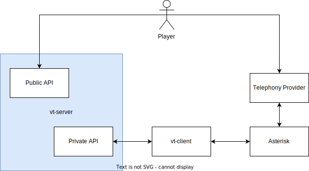

# Architecture

## High Level Overview

The player starts by visiting the website, which is served by the public API.
Upon loading, the JavaScript establishes a web socket connection with the public
API, which is then used to send updates about the game from the server to the
client.

When visiting the website, a code is displayed which serves as the password to
play the game. The player must then call the on the website displayed number and
enter the displayed code. After finding another player the game begins and each
player can input their digit to select a field.

## Implementation Details

### Telephony Provider

An external, third-party instance that provides a phone number which users can
call. Incoming calls are then forwarded to the locally running Asterisk
instance.

### Asterisk

Used to accept incoming calls from a telephony provider and to get user input in
the form of DTMF codes. For each incoming call, a new `vt-client` process is
spawned, which delegates the communication between the private API and Asterisk.

### vt-server

The public and private API are both served from the same `vt-server` process.
The public API serves the frontend code as well as a web socket endpoint whose
only purpose is to send updates to the player. Because only server to client
updates are needed, we could use server sent events, but so far we use web
sockets as they are easy enough.

The private API is used for verifying generated codes and to get user input from
clients through the telephony provider.

### vt-client

Each `vt-client` process is spawned by Asterisk. Upon start it gets the
verification code as DTMF codes and then tries to register itself with the
private API. When registering, the `vt-client` sends the verification code
together with webhook URLs to the private API. If the code exists, then the
register process is successfull. The webhooks are used in order for the
`vt-server` to communicate with the `vt-client` on demand.

Webhooks are used for the following scenarios:

-   Request a new digit from the `vt-client`.
-   Check the `vt-client` for a heartbeat to detect whether the client is still
    connected.
-   Notify the `vt-client` that the game has ended and the call can be hung up.
